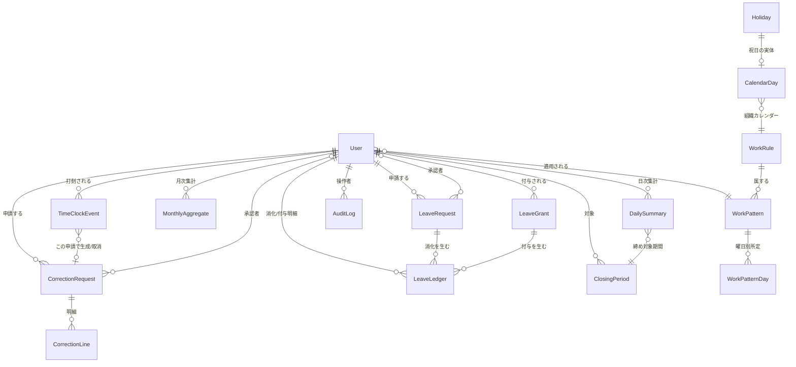

# データモデル

DB: PostgreSQL 16 / ORM: Prisma。時刻は `timestamptz`（UTC 保存、JST 変換は表示・集計層）。
日付のみの概念（勤務日・休暇日・カレンダー）は `date` 型。

## 1. ER 図

## 2. 列挙型

| enum               | 値                                                                                                                                    |
| ------------------ | ------------------------------------------------------------------------------------------------------------------------------------- |
| `Role`             | `EMPLOYEE`, `ADMIN`                                                                                                                   |
| `EmploymentType`   | `FULL_TIME`, `PART_TIME`, `CONTRACT`                                                                                                  |
| `UserStatus`       | `ACTIVE`, `DISABLED`                                                                                                                  |
| `ClockType`        | `CLOCK_IN`, `CLOCK_OUT`, `BREAK_START`, `BREAK_END`                                                                                   |
| `ClockSource`      | `SELF`, `ADMIN_PROXY`, `CORRECTION`                                                                                                   |
| `RequestStatus`    | `DRAFT`, `PENDING`, `APPROVED`, `REJECTED`, `CANCELED`                                                                                |
| `CorrectionOp`     | `ADD`, `UPDATE`, `DELETE`                                                                                                             |
| `LeaveType`        | `PAID`, `ABSENCE`, `SPECIAL_UNPAID`                                                                                                   |
| `LeaveDayPart`     | `FULL`, `AM`, `PM`                                                                                                                    |
| `LeaveLedgerKind`  | `GRANT`, `CONSUME`, `EXPIRE`, `ADJUST`                                                                                                |
| `LeaveRequestKind` | `TAKE`（取得）, `CANCELLATION`（承認済休暇の取消申請）                                                                                |
| `BreakPolicy`      | `ACTUAL`, `AUTO_DEDUCT`（WorkRule.breakPolicy を enum 化）                                                                            |
| `HolidaySource`    | `BUILTIN`, `MANUAL`（Holiday.source を enum 化）                                                                                      |
| `DayType`          | `WORKDAY`, `PRESCRIBED_HOLIDAY`, `LEGAL_HOLIDAY`                                                                                      | <!-- 平日 / 所定休日 / 法定休日 --> |
| `ClosingStatus`    | `OPEN`, `CLOSED`                                                                                                                      |
| `AuditAction`      | `CLOCK_EDIT`, `APPROVE`, `REJECT`, `CLOSE`, `REOPEN`, `USER_CREATE`, `USER_DISABLE`, `PASSWORD_RESET`, `MASTER_CHANGE`, `LEAVE_GRANT` |

## 3. テーブル定義

### 3.1 User — 従業員

| 列                    | 型             | 制約 / 既定      | 説明                                                                       |
| --------------------- | -------------- | ---------------- | -------------------------------------------------------------------------- |
| id                    | uuid           | PK               |                                                                            |
| employeeCode          | text           | UNIQUE           | 社員番号                                                                   |
| email                 | text           | UNIQUE           | ログイン ID。citext 拡張は使わず、アプリ層で必ず小文字化して保存・検索する |
| name                  | text           |                  | 氏名                                                                       |
| passwordHash          | text           |                  | bcrypt                                                                     |
| role                  | Role           | 既定 `EMPLOYEE`  |                                                                            |
| employmentType        | EmploymentType | 既定 `FULL_TIME` |                                                                            |
| status                | UserStatus     | 既定 `ACTIVE`    |                                                                            |
| hireDate              | date           |                  | 入社日（有給付与の基準に利用）                                             |
| workPatternId         | uuid           | FK → WorkPattern | 適用する所定勤務                                                           |
| mustChangePassword    | boolean        | 既定 `true`      | 初回ログイン強制変更                                                       |
| createdAt / updatedAt | timestamptz    |                  |                                                                            |

インデックス: `(status)`, `(role)`。

### 3.2 WorkRule — 就業規則（組織単位・単一運用だが将来複数化に備え表で保持）

| 列                        | 型          | 既定                                                                            | 説明                                         |
| ------------------------- | ----------- | ------------------------------------------------------------------------------- | -------------------------------------------- |
| id                        | uuid        | PK                                                                              |                                              |
| name                      | text        | `"標準"`                                                                        |                                              |
| isDefault                 | boolean     | `true`                                                                          | 既定で全ユーザーに適用                       |
| standardDailyMinutes      | int         | `480`                                                                           | 所定労働（分）/日                            |
| closingDay                | int         | `31`                                                                            | 締め日。31=月末。1–28 or 31                  |
| weekStartsOn              | int         | `1`                                                                             | 週起算（0=日,1=月）。週40h 判定用            |
| overtimeRatePct           | int         | `25`                                                                            | 時間外割増 %                                 |
| nightRatePct              | int         | `25`                                                                            | 深夜割増 %                                   |
| legalHolidayRatePct       | int         | `35`                                                                            | 法定休日割増 %                               |
| over60hRatePct            | int         | `50`                                                                            | 月60h 超の時間外割増 %                       |
| nightStart                | text        | `"22:00"`                                                                       | 深夜開始（JST, HH:mm）                       |
| nightEnd                  | text        | `"05:00"`                                                                       | 深夜終了（翌日）                             |
| breakPolicy               | text        | `"ACTUAL"`                                                                      | `ACTUAL`=実打刻採用 / `AUTO_DEDUCT`=所定控除 |
| autoBreakRules            | jsonb       | `[{"overMinutes":360,"breakMinutes":45},{"overMinutes":480,"breakMinutes":60}]` | AUTO_DEDUCT 時の控除段階                     |
| roundingUnitMinutes       | int         | `1`                                                                             | 打刻丸め（1=なし）                           |
| legalHolidayWeekday       | int         | `0`                                                                             | 法定休日の曜日（既定 日曜）                  |
| prescribedHolidayWeekdays | int[]       | `[6]`                                                                           | 所定休日の曜日（既定 土曜）                  |
| updatedAt                 | timestamptz |                                                                                 |                                              |

> 現行は 1 行（`isDefault=true`）。設定画面で編集。監査ログに変更前後を記録。

### 3.3 WorkPattern / WorkPatternDay — 勤務パターン

WorkPattern

| 列         | 型                 | 説明               |
| ---------- | ------------------ | ------------------ |
| id         | uuid PK            |                    |
| workRuleId | uuid FK → WorkRule |                    |
| name       | text               | 例「標準 9-18」    |
| isDefault  | boolean            | 新規ユーザーの既定 |

WorkPatternDay（曜日ごとの所定。休業曜日は行を作らないか `isWorkday=false`）

| 列                | 型      | 説明                                       |
| ----------------- | ------- | ------------------------------------------ |
| id                | uuid PK |                                            |
| workPatternId     | uuid FK |                                            |
| weekday           | int     | 0–6                                        |
| isWorkday         | boolean |                                            |
| startTime         | text    | `"09:00"`                                  |
| endTime           | text    | `"18:00"`                                  |
| breakMinutes      | int     | 所定休憩（分）。AUTO_DEDUCT の基準にも利用 |
| prescribedMinutes | int     | 当該曜日の所定労働（分）                   |

UNIQUE `(workPatternId, weekday)`。

### 3.4 TimeClockEvent — 打刻イベント（追記のみ／不変・取消フラグ運用）

| 列                  | 型          | 制約                   | 説明                                           |
| ------------------- | ----------- | ---------------------- | ---------------------------------------------- |
| id                  | uuid        | PK                     |                                                |
| userId              | uuid        | FK → User              |                                                |
| type                | ClockType   |                        |                                                |
| occurredAt          | timestamptz |                        | 打刻時刻（秒精度）                             |
| businessDate        | date        |                        | 勤務日（日跨ぎは出勤日に寄せる）。導出時に確定 |
| source              | ClockSource | 既定 `SELF`            |                                                |
| canceled            | boolean     | 既定 `false`           | 修正で無効化された場合 true                    |
| correctionRequestId | uuid?       | FK → CorrectionRequest | この申請で追加/取消された                      |
| createdById         | uuid        | FK → User              | 実際に登録した人（代理打刻の操作者）           |
| note                | text?       |                        | 代理・修正時の理由                             |
| createdAt           | timestamptz |                        |                                                |

インデックス: `(userId, businessDate)`, `(userId, occurredAt)`, `(canceled)`。

### 3.5 DailySummary — 日次サマリ（打刻・休暇・マスタから決定的に導出、再計算可能）

| 列                              | 型            | 説明                                                         |
| ------------------------------- | ------------- | ------------------------------------------------------------ |
| id                              | uuid PK       |                                                              |
| userId                          | uuid FK       |                                                              |
| workDate                        | date          |                                                              |
| dayType                         | DayType       | 平日／所定休日／法定休日（カレンダーで判定）                 |
| firstIn / lastOut               | timestamptz?  | 当日の代表出退勤                                             |
| breakMinutes                    | int           | 休憩合計（実打刻 or 自動控除）                               |
| workedMinutes                   | int           | 実労働（休憩控除後）                                         |
| prescribedMinutes               | int           | 当日の所定                                                   |
| withinStatutoryOtMinutes        | int           | 法定内残業（所定超〜8h まで）                                |
| overStatutoryOtMinutes          | int           | 法定外残業（8h 超、深夜・休日と重複ぶんを除く純時間外）      |
| nightMinutes                    | int           | 深夜帯の労働                                                 |
| legalHolidayMinutes             | int           | 法定休日の労働                                               |
| lateMinutes / earlyLeaveMinutes | int           | 遅刻・早退                                                   |
| leaveType                       | LeaveType?    | 当日が休暇なら種別                                           |
| leaveDayPart                    | LeaveDayPart? |                                                              |
| paidLeaveCountedMinutes         | int           | 有給で労働扱いに算入した分（全日=所定, 半休=所定/2）         |
| flags                           | jsonb         | `["MISSING_CLOCK_OUT","BREAK_SHORTAGE","HOLIDAY_WORK", ...]` |
| closingPeriodId                 | uuid? FK      | 締め対象期間                                                 |
| computedAt                      | timestamptz   | 最終再計算時刻                                               |

UNIQUE `(userId, workDate)`。

> **月60h 超の 50% 割増は月次で判定**するため、日次では `overStatutoryOtMinutes` までを持ち、
> 50% 対象ぶんは `MonthlyAggregate` 側で切り出す（`04-aggregation-spec.md` §5）。

### 3.6 MonthlyAggregate — 月次集計（キャッシュ。無効化されたら再計算）

| 列                                  | 型          | 説明                                     |
| ----------------------------------- | ----------- | ---------------------------------------- |
| id                                  | uuid PK     |                                          |
| userId                              | uuid FK     |                                          |
| periodStart / periodEnd             | date        | 締め日で区切った期間                     |
| workDays                            | int         | 出勤日数                                 |
| absenceDays                         | int         | 欠勤日数                                 |
| paidLeaveFullDays                   | int         | 有給全日                                 |
| paidLeaveHalfDays                   | int         | 有給半日（回数）                         |
| paidLeaveMinutes                    | int         | 有給みなし労働時間の合計（賃金支払対象） |
| totalWorkedMinutes                  | int         |                                          |
| withinPrescribedMinutes             | int         | 所定内                                   |
| withinStatutoryOtMinutes            | int         | 法定内残業                               |
| overtime25Minutes                   | int         | 時間外 25%（月60h まで）                 |
| overtime50Minutes                   | int         | 時間外 50%（月60h 超）                   |
| nightMinutes                        | int         | 深夜 25%                                 |
| legalHolidayMinutes                 | int         | 法定休日 35%                             |
| lateCount / lateMinutes             | int         |                                          |
| earlyLeaveCount / earlyLeaveMinutes | int         |                                          |
| breakMinutes                        | int         |                                          |
| stale                               | boolean     | true の間は要再計算                      |
| computedAt                          | timestamptz |                                          |

UNIQUE `(userId, periodStart)`。

### 3.7 CorrectionRequest / CorrectionLine — 打刻修正申請

CorrectionRequest

| 列                    | 型              | 説明                                               |
| --------------------- | --------------- | -------------------------------------------------- |
| id                    | uuid PK         |                                                    |
| userId                | uuid FK         | 申請者                                             |
| targetDate            | date            | 対象勤務日                                         |
| status                | RequestStatus   | `DRAFT`→`PENDING`→`APPROVED`/`REJECTED`/`CANCELED` |
| reason                | text            | 必須                                               |
| approverId            | uuid? FK → User |                                                    |
| decidedAt             | timestamptz?    |                                                    |
| decisionComment       | text?           | 却下時必須                                         |
| createdAt / updatedAt | timestamptz     |                                                    |

CorrectionLine（申請明細。1 申請に複数）

| 列            | 型                        | 説明                  |
| ------------- | ------------------------- | --------------------- |
| id            | uuid PK                   |                       |
| requestId     | uuid FK                   |                       |
| op            | CorrectionOp              | ADD / UPDATE / DELETE |
| targetEventId | uuid? FK → TimeClockEvent | UPDATE/DELETE 対象    |
| clockType     | ClockType?                | ADD/UPDATE の種別     |
| occurredAt    | timestamptz?              | ADD/UPDATE の時刻     |

### 3.8 LeaveRequest — 休暇申請

| 列                    | 型                      | 説明                                                 |
| --------------------- | ----------------------- | ---------------------------------------------------- |
| id                    | uuid PK                 |                                                      |
| userId                | uuid FK                 |                                                      |
| type                  | LeaveType               |                                                      |
| startDate / endDate   | date                    | 単日は同値                                           |
| dayPart               | LeaveDayPart            | `FULL` / `AM` / `PM`（期間指定時は `FULL` のみ許可） |
| reason                | text                    |                                                      |
| kind                  | LeaveRequestKind        | `TAKE` / `CANCELLATION`。既定 `TAKE`                 |
| status                | RequestStatus           | `PENDING`→`APPROVED`/`REJECTED`/`CANCELED`           |
| approverId            | uuid? FK                |                                                      |
| decidedAt             | timestamptz?            |                                                      |
| decisionComment       | text?                   |                                                      |
| supersededById        | uuid? FK → LeaveRequest | 取消申請で無効化されたら参照                         |
| createdAt / updatedAt | timestamptz             |                                                      |

制約: 同一ユーザーで期間が重なる `PENDING`/`APPROVED` は不可（アプリ層で検証）。

### 3.9 LeaveGrant / LeaveLedger — 有給付与と残数台帳

LeaveGrant

| 列          | 型             | 説明                      |
| ----------- | -------------- | ------------------------- |
| id          | uuid PK        |                           |
| userId      | uuid FK        |                           |
| grantedDays | numeric(4,1)   | 付与日数（半日=0.5 対応） |
| grantDate   | date           | 付与日                    |
| expiryDate  | date           | 失効日（消化順の基準）    |
| reason      | text           |                           |
| createdById | uuid FK → User | 付与操作者                |

LeaveLedger（付与・消化・失効・調整の明細。残数はこの合算で算出）

| 列             | 型                      | 説明                                |
| -------------- | ----------------------- | ----------------------------------- |
| id             | uuid PK                 |                                     |
| userId         | uuid FK                 |                                     |
| kind           | LeaveLedgerKind         | `GRANT`/`CONSUME`/`EXPIRE`/`ADJUST` |
| days           | numeric(4,1)            | +付与 / −消化・失効                 |
| effectiveDate  | date                    |                                     |
| grantId        | uuid? FK → LeaveGrant   | どの付与に紐づくか（FIFO 消化）     |
| leaveRequestId | uuid? FK → LeaveRequest | 消化の originating 申請             |
| note           | text?                   |                                     |
| createdAt      | timestamptz             |                                     |

**残日数 = Σ LeaveLedger.days（当該ユーザー、effectiveDate ≤ 基準日、失効済み付与を除外）。**

### 3.10 CalendarDay / Holiday — 休日カレンダー

Holiday（内蔵祝日データの実体。`data/holidays.json` から seed）

| 列     | 型          | 説明                 |
| ------ | ----------- | -------------------- |
| id     | uuid PK     |                      |
| date   | date UNIQUE |                      |
| name   | text        | 例「建国記念の日」   |
| source | text        | `BUILTIN` / `MANUAL` |

CalendarDay（組織カレンダー。祝日・振替・特別営業日を吸収した最終判定）

| 列             | 型      | 説明                               |
| -------------- | ------- | ---------------------------------- |
| id             | uuid PK |                                    |
| workRuleId     | uuid FK |                                    |
| date           | date    |                                    |
| dayType        | DayType | 最終的な平日／所定休日／法定休日   |
| isHoliday      | boolean | 休業日か（祝日・会社休業）         |
| label          | text?   | 表示名（「祝日」「創立記念日」等） |
| overrideReason | text?   | 手動上書き時                       |

UNIQUE `(workRuleId, date)`。
判定の優先順位: CalendarDay の手動上書き > 祝日(Holiday) > WorkRule の曜日設定（法定休日曜日／所定休日曜日）。

### 3.11 ClosingPeriod — 月次締め

| 列                      | 型              | 説明              |
| ----------------------- | --------------- | ----------------- |
| id                      | uuid PK         |                   |
| periodStart / periodEnd | date            | 締め対象期間      |
| status                  | ClosingStatus   | `OPEN` / `CLOSED` |
| closedById              | uuid? FK → User |                   |
| closedAt                | timestamptz?    |                   |
| reopenedById            | uuid? FK → User |                   |
| reopenedAt              | timestamptz?    |                   |
| note                    | text?           |                   |

UNIQUE `(periodStart)`。締め対象は全ユーザー一括。ユーザー個別締めは将来拡張。

### 3.12 AuditLog — 監査ログ（追記のみ）

| 列            | 型              | 説明                                            |
| ------------- | --------------- | ----------------------------------------------- |
| id            | uuid PK         |                                                 |
| actorId       | uuid FK → User  | 操作者                                          |
| action        | AuditAction     |                                                 |
| targetType    | text            | 例 `TimeClockEvent`, `LeaveRequest`, `WorkRule` |
| targetId      | text?           |                                                 |
| subjectUserId | uuid? FK → User | 影響を受けた従業員                              |
| before        | jsonb?          | 変更前                                          |
| after         | jsonb?          | 変更後                                          |
| comment       | text?           | 理由・却下コメント                              |
| createdAt     | timestamptz     |                                                 |

インデックス: `(createdAt)`, `(subjectUserId, createdAt)`, `(action)`。

### 3.13 Auth.js 補助テーブル

Credentials + JWT セッションのみ利用のため、`Account` / `Session` / `VerificationToken` は
原則不要。JWT 戦略で運用し、必要になった時点で追加する。

## 4. 主要な整合ルール（DB＋アプリ）

1. `TimeClockEvent` は物理削除しない。修正は `canceled=true` ＋新規行、`correctionRequestId` で追跡。
2. `DailySummary` / `MonthlyAggregate` はいつでも打刻・休暇・マスタから再構築できる（キャッシュ）。
   打刻/申請/マスタ変更時に該当日の `DailySummary` 再計算＋対応する `MonthlyAggregate.stale=true`。
3. `ClosingPeriod.status=CLOSED` の期間に交差する打刻追加・修正反映・休暇反映は拒否（再オープンが前提）。
4. 有給残数は `LeaveLedger` の合算のみを真実とする。`LeaveRequest` 承認時に `CONSUME` 行を FIFO（`expiryDate` 昇順）で生成。
5. すべての write 系操作は同一トランザクション内で `AuditLog` を書く。
6. マスタ（`WorkRule` / `CalendarDay`）変更後の再計算は自動ではなく ADMIN の明示操作（`recomputeRange`）。
   どの `WorkRule` 版で計算された `DailySummary` かは現状追跡しない（単一組織・単一 `WorkRule` 前提）。
   複数 `WorkRule` や版管理が必要になった時点で `DailySummary.computedWithRuleId` を追加する。
7. 「既定の `WorkRule` は 1 件」「`WorkPattern.isDefault` は `WorkRule` ごと 1 件」は DB 制約（部分 UNIQUE）ではなく
   アプリ層で担保する（Prisma が部分インデックスを宣言できないため）。
