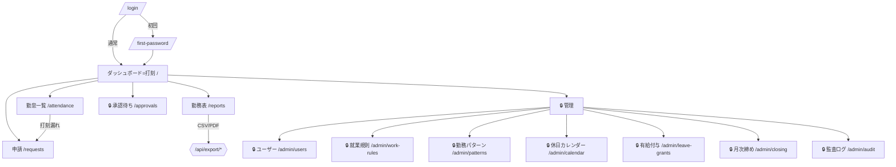

# 画面一覧・遷移

- 全画面ログイン必須（`/login`, `/first-password` を除く）。
- レイアウトはヘッダー＋左サイドナビ（`AppNav`）。メニューはロールで出し分け。
- 🔒 = ADMIN 限定。

## 1. 画面遷移図

## 2. 画面別仕様

### 2.1 `/login` — ログイン

- 入力: メール、パスワード。エラーは「メールまたはパスワードが違います」で一律
  （無効化ユーザー・パスワード誤りを区別しない）。試行はレート制限（IP＋メール、簡易）。
- 成功時: `mustChangePassword` なら `/first-password`、それ以外は元の URL または `/`。

### 2.2 `/first-password` — 初回パスワード変更

- 現パスワード（初期発行値）、新パスワード（8 文字以上、確認）。
- 変更で `mustChangePassword=false`。監査ログ `PASSWORD_RESET`（本人操作）。

### 2.3 `/` — ダッシュボード（打刻）

- 現在の状態バッジ（未出勤/勤務中/休憩中/退勤済）と対象勤務日（日跨ぎ勤務時はその旨を表示）。
- 状態に応じて押せる打刻ボタンのみ表示（例: 勤務中なら「休憩開始」「退勤」）。
- 当日の実働・休憩・法定外残業・深夜のサマリ、本日の打刻イベント一覧、フラグ（打刻漏れ等）。
- 打刻はサーバ時刻採用（クライアント時刻は送らない）。

### 2.4 `/attendance` — 勤怠一覧

- 期間切替（締め日で区切った期間単位。前後の月ラベル表示＋「今月」に戻るボタン）。
- 日別テーブル（`AttendanceTable`、`/reports` と共用）: 出退勤・休憩・実働・
  法定内/法定外残業・深夜・法定休日・遅刻早退・休暇・フラグ。
- ADMIN は対象ユーザーを切り替え可能。

### 2.5 `/requests` — 申請（作成・自分の状況）

- 1 画面で「休暇申請」フォームと「打刻修正申請」フォームを並べて表示し、
  その下に「休暇申請の状況」「打刻修正申請の状況」の一覧テーブルを表示する
  （別画面・詳細ページには分けない）。
- 打刻修正フォーム: 対象勤務日を選ぶと、その日の有効な打刻から対象を選択できる
  （生の ID を手入力させない）。操作（追加/変更/削除）、種別、時刻、日付をまたぐ場合の
  チェックボックスを明細ごとに指定。理由必須。
- 休暇フォーム: 種別（有給/欠勤/特別休暇(無給)）、全日/半日、期間、理由。
  申請時点の有給残日数を表示。期間重複チェックあり。
- 状況テーブルは `PENDING` の行にのみ [取消] を表示。理由が長い場合は省略表示＋ホバーで全文。
- 締め済み期間への申請はエラーで拒否（案内文はエンドユーザー向けの内容のみ。
  再オープン手順は管理者向けエラーにのみ表示）。

### 2.6 `/approvals` 🔒 — 承認待ち一覧

- 打刻修正・休暇・休暇取消申請をまとめて 1 覧表示（古い順）。自分自身の申請は除外
  （件数のみ案内）。
- 各行に申請者・対象日・明細サマリ・理由を表示し、その場で [承認] / [却下（コメント必須）]
  を行う（別画面の詳細ページには遷移しない）。
- 自己申請は一覧から除外することで承認できないようにしている。
- 処理後、対象日の `DailySummary` と月次集計を再計算対象にし、監査ログに記録する。

### 2.7 `/reports` — 勤務表

- 対象: 自分（ADMIN はユーザー選択＋全員サマリ CSV）。
- 期間切替＋統計カード（出勤日数・総労働・所定内・法定内/法定外残業・深夜・法定休日・
  有給・欠勤・遅刻・早退など）。
- 日別の労働時間内訳を積み上げ棒グラフで表示（`dataviz` skill 準拠の配色。期間の全日を表示）。
- 出力: [日別 CSV] [サマリ CSV] [勤務表 PDF]（ADMIN は [全員サマリ CSV] も）。
- 締め済みかどうかは PDF 内の注記でのみ判別（画面上に専用バッジは無い）。

### 2.8 `/admin/users` 🔒 — ユーザー管理

- 一覧: 社員番号・氏名・メール・ロール・雇用区分・勤務パターン・状態（PW未変更バッジ含む）。
- [新規ユーザーを発行]: 氏名/メール/社員番号/入社日/雇用区分/ロール/勤務パターン。
  作成時 `mustChangePassword=true`、初期パスワードを一度だけ画面表示。監査 `USER_CREATE`。
- 行操作: [PW リセット]（新しい初期パスワードを画面表示）、[無効化]/[再有効化]
  （自分自身は変更不可）。

### 2.9 `/admin/work-rules` 🔒 — 就業規則設定

- `WorkRule`（既定 1 件）の編集フォーム: 所定労働分/日、締め日、週起算、割増率各種、
  深夜帯、休憩の基準（実打刻採用/所定休憩を自動控除）、法定休日の曜日、所定休日の曜日。
- 保存時に変更前後を監査 `MASTER_CHANGE`。既存データへの再計算は `/admin/closing` の
  [全員を再計算] から明示的に実行する（保存時に自動では走らない）。

### 2.10 `/admin/patterns` 🔒 — 勤務パターン

- パターンごとに曜日別（`WorkPatternDay`）の始業/終業/休憩/所定労働分を編集。
- ユーザーへの割当は `/admin/users` の新規発行時に選択する。

### 2.11 `/admin/calendar` 🔒 — 休日カレンダー

- 内蔵祝日（`Holiday`）の一覧と [内蔵祝日を再取込] ボタン。
- 組織カレンダー（`CalendarDay`）による特定日の上書き（区分・休日扱い・理由）一覧と追加フォーム。
- 判定優先順位: 手動上書き ＞ 祝日 ＞ 曜日設定（`WorkRule` の法定/所定休日曜日）。

### 2.12 `/admin/leave-grants` 🔒 — 有給付与

- ユーザーごとの残日数一覧。
- [付与を追加]: 日数・付与日・失効日・理由。監査 `LEAVE_GRANT`。
- [台帳を調整]: 誤付与の補正など、理由付きで台帳行を追加。

### 2.13 `/admin/closing` 🔒 — 月次締め

- 直近の OPEN 期間の締め前チェック（未処理の打刻修正・休暇件数、フラグのある日数、
  打刻漏れユーザー一覧）と、期間指定の [全員を再計算]。
- 期間一覧（`ClosingPeriod`）と状態。OPEN 期間は [締める]（確認ダイアログ）、
  CLOSED 期間は [再オープン]（理由必須）。締め/再オープンは監査 `CLOSE`/`REOPEN`。

### 2.14 `/admin/audit` 🔒 — 監査ログ

- アクション種別でフィルタ（打刻編集・承認・却下・締め・再オープン・ユーザー作成/無効化・
  パスワード・マスタ変更・有給付与、最大 200 件・新しい順）。
- 行: 日時・操作・操作者・対象・対象者・コメント。「差分」を開くと before/after を
  フィールド単位の変更点（例: 「締め日: 31 → 20」）として表示する（生 JSON はそのまま出さない）。

## 3. 共通コンポーネント

| 名前                | 用途                                                     |
| ------------------- | -------------------------------------------------------- |
| `ClockPanel`        | ダッシュボードの状態連動の打刻ボタン群・当日サマリ       |
| `Minutes`/`JstTime` | 分 → `H:MM`、ISO → JST `HH:mm` の統一表示                |
| `AttendanceTable`   | 勤怠一覧・勤務表で共有する日別テーブル                   |
| `PeriodNav`         | 締め期間の前後切替（月ラベル表示）＋「今月」に戻るボタン |
| `UserPicker`        | ADMIN のユーザー切替                                     |
| `flag-labels`       | 日次フラグの日本語ラベル・重要度別の配色                 |

## 4. アクセシビリティ / UX 方針

- 打刻ボタンはキーボード操作可・状態を色だけに依存しない（アイコン/バッジ＋ラベル）。
- 破壊的操作（締め、無効化、却下）は確認ダイアログ＋理由入力。
- 日付表記は画面上では `YYYY/MM/DD`（勤怠一覧の日別行のみ `M/D(曜)`）。時刻は 24 時間表記。
- 数値は等幅、分は常に `H:MM`。CSV は別途生値（ISO 日付・raw 分）。
